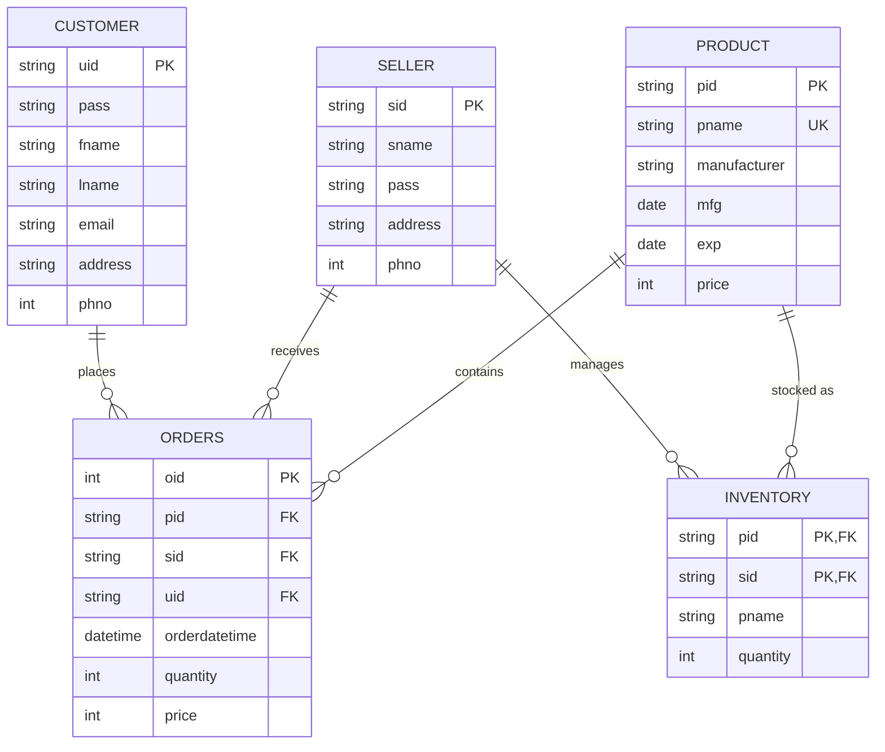
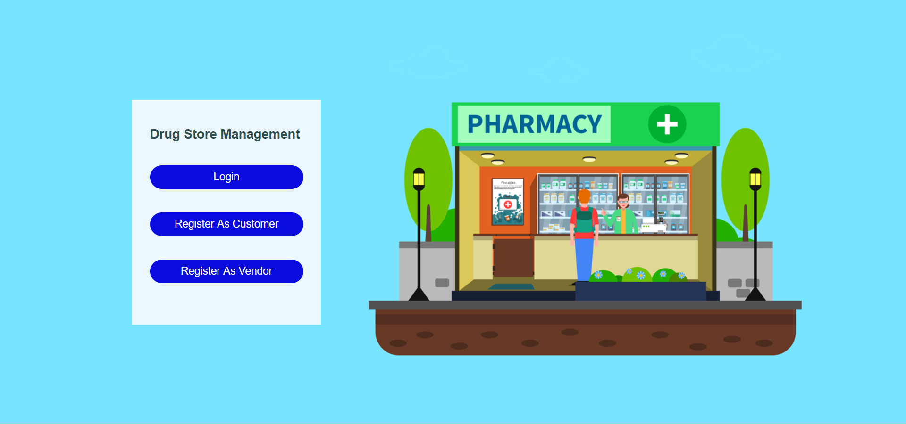
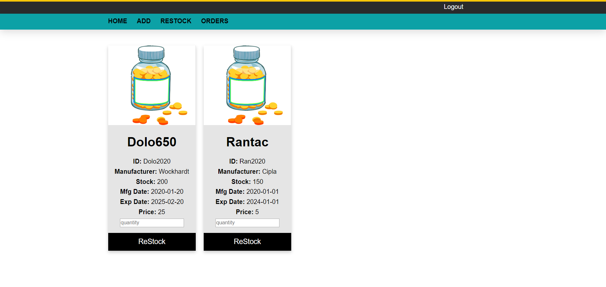
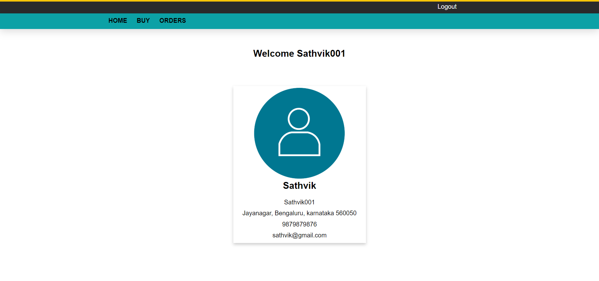

# 💊 Pharmacy & Drug Management System

[](https://nodejs.org/)
[](https://expressjs.com/)
[](https://www.sqlite.org/)
[](#license)
[](#)

A full-featured **Pharmacy & Drug Management Web Application** designed for seamless pharmaceutical inventory control, customer drug purchasing, and vendor sales tracking.

The system features dual role-based access for **Customers** and **Vendors (Sellers)**, supported by a robust backend database, inventory auto-deduction triggers, and interactive dashboards.

---

## 🌟 Key Features

### 👤 Customer Portal
- **User Authentication**: Secure registration and login system.
- **Product Catalog**: Browse available pharmaceutical products with live stock status, prices, manufacturer details, and expiration dates.
- **Instant Ordering**: Select medicine quantities and place orders with real-time total price calculation.
- **Order History**: Track past order details including Order ID, timestamp, quantity, and total cost.

### 🏪 Vendor / Seller Portal
- **Vendor Dashboard**: Personal seller profile with store location and contact details.
- **Add New Products**: Introduce new drugs into the global pharmacy registry with batch IDs, manufacturing & expiration dates, and unit pricing.
- **Stock Management & Restocking**: Monitor live inventory levels for all managed drugs and add stock on the fly.
- **Sales & Order Tracking**: View customer orders placed for vendor products in real time.

### ⚡ Modern Backend & Database Architecture
- **Zero-Config Database**: Powered by SQLite3 (`pharmacy.db`) with auto-seeding for instant demo testing.
- **Relational Integrity**: Foreign key enforcement across customers, sellers, products, inventory, and orders.
- **Session Management**: Server-side session tracking with multi-user isolation.
- **MySQL Compatibility**: Includes legacy `drugdatabase.sql` script with procedures and triggers for MySQL deployment.

---

## 🛠️ Technology Stack

| Layer | Technology |
| :--- | :--- |
| **Frontend** | HTML5, CSS3, JavaScript |
| **Backend Framework** | Node.js, Express.js |
| **Session Management** | Express-Session |
| **Database** | SQLite3 (`better-sqlite3`), MySQL (Optional Legacy Support) |
| **Styling** | Custom Responsive CSS Design |

---

## 📁 Project Structure

```
Pharmacy-Drug-Management-System/
├── package.json                   # Node.js dependencies & scripts
├── server.js                      # Express web server & route handlers
├── pharmacy.db                    # Auto-generated SQLite database
├── README.md                      # Project documentation
└── Pharmacy-Drug-Management-System/
    ├── drugdatabase.sql           # MySQL Database creation script & triggers
    ├── SQL.txt                    # SQL Queries reference
    ├── Screenshots/               # System preview screenshots
    └── Pharmacy-Drug-Mangement/
        ├── WebContent/            # Web application assets & pages
        │   ├── css/               # Modular CSS stylesheet bundle
        │   ├── images/            # UI images (avatars, pills, backgrounds)
        │   ├── Index.html         # Landing page
        │   ├── Login.html         # User authentication form
        │   ├── Register.html      # Customer registration form
        │   ├── SellerRegister.html# Vendor registration form
        │   ├── AddProduct.html    # Add product form
        │   └── *.jsp              # Dynamic web page templates
        └── build.xml              # Legacy Ant build file for Java/Tomcat
```

---

## 🚀 Quick Start Guide

### Prerequisites
- [Node.js](https://nodejs.org/) (v16.x or higher)
- [npm](https://www.npmjs.com/) (installed automatically with Node.js)

### 1. Install Dependencies
Run the following command in the project root folder:
```bash
npm install
```

### 2. Start the Web Server
Launch the Node.js web server:
```bash
npm start
```
*Or run in development mode:*
```bash
npm run dev
```

### 3. Open in Browser
Navigate to `http://localhost:3000` in your web browser (Google Chrome, Firefox, Edge, etc.).

---

## 🔑 Demo Credentials

The database automatically seeds with default test accounts upon first run:

| Role | User ID | Password | Access Rights |
| :--- | :--- | :--- | :--- |
| **Customer** | `cust123` | `pass123` | Browse Drugs, Buy Products, View Order History |
| **Vendor** | `seller123` | `pass123` | Add Products, Restock Stock, View Sales Orders |

---

## 📊 Database Schema (Entity-Relationship)



---

## 🌐 Application Navigation & Routes

| Route | Method | Description |
| :--- | :---: | :--- |
| `/` | `GET` | Main Landing Page (Login / Customer Register / Vendor Register) |
| `/Login.html` | `GET` | Role-based User Login Form |
| `/Login.jsp` | `POST` | Authenticates Customer/Seller credentials |
| `/Register.html` | `GET` | Customer Account Registration Form |
| `/Register.jsp` | `POST` | Registers a new Customer in database |
| `/SellerRegister.html` | `GET` | Vendor Registration Form |
| `/SellerRegister.jsp` | `POST` | Registers a new Vendor in database |
| `/Homepage.jsp` | `GET` | Customer Dashboard showing user profile card |
| `/SellerHomepage.jsp` | `GET` | Vendor Dashboard showing store profile card |
| `/Buy.jsp` | `GET` | Customer Marketplace listing available medicines |
| `/PlaceOrder.jsp` | `POST` | Processes purchase and updates inventory levels |
| `/Orders.jsp` | `GET` | Customer Purchase History Table |
| `/AddProduct.html` | `GET` | Vendor Form to add a new drug to catalog |
| `/AddProduct.jsp` | `POST` | Inserts new product & creates initial inventory |
| `/AddInventory.jsp` | `GET` | Vendor Restock Management Dashboard |
| `/UpdateInventory.jsp` | `POST` | Increments stock quantity for a vendor product |
| `/SellerOrders.jsp` | `GET` | Vendor Sales Orders Table |
| `/Logout.jsp` | `GET` | Terminates user session and redirects to landing page |

---

## 🗄️ MySQL Database Setup (Optional)

If you prefer using **MySQL Server** instead of SQLite:
1. Open your MySQL client (e.g. Workbench or CLI).
2. Execute the provided SQL script:
   ```bash
   mysql -u root -p < Pharmacy-Drug-Management-System/drugdatabase.sql
   ```
3. Update connection parameters in your database configuration file if required.

---

## 📸 Interface Screenshots

| Landing Page | Product Marketplace |
| :---: | :---: |
|  |  |

| Vendor Restock | Customer Orders |
| :---: | :---: |
|  |  |

---

## 📄 License

This project is open-source and available under the [MIT License](LICENSE).
